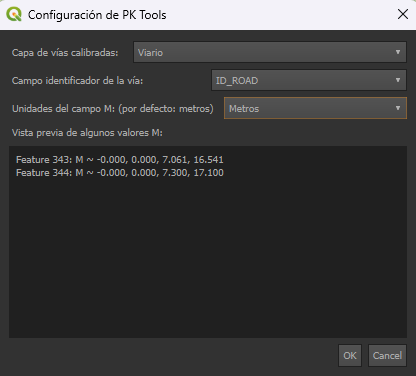

# PK Tools

**PK Tools** unifica tres herramientas en un único complemento de QGIS:

---

## 🔧 ¿Qué hace PK Tools?

PK Tools está pensado para capas de carreteras **lineales con geometría M** (calibración).  
Trabaja siempre sobre **una capa de trabajo configurable**, y a partir de ella ofrece tres herramientas:

---

## 🧭 Identificar PK

Permite identificar la vía y el punto kilométrico haciendo clic sobre una capa de carreteras (líneas calibradas con valores M).

- Muestra:
  - El nombre de la vía.
  - El PK interpolado (en km y en formato `km+000`).
  - Un enlace a Street View.
  - Botones para copiar vía, PK y coordenadas al portapapeles.
- Mantiene un **historial interno** de puntos identificados que se puede exportar a una capa temporal de puntos.
- El punto identificado queda marcado hasta que se selecciona otro o se apaga la herramienta.

---

## 📍 Localizar PK

Abre una ventana donde el usuario puede introducir:

- La carretera (mediante el campo identificador configurado).
- Un PK (kilómetros + metros).

El complemento:

- Ubica el punto exacto en el mapa sobre la capa calibrada.
- Dibuja un marcador en el mapa.
- Muestra un enlace a Street View y un botón para centrar el mapa.
- Mantiene un **historial** accesible desde el menú desplegable del botón.
- Permite exportar puntos seleccionados del historial a una capa temporal.

---

## 📏 Distancia PK

Permite medir la **distancia entre dos PKs sobre la misma vía**, mostrando:

- La diferencia de PK (basada en los valores M de la capa).
- La distancia lineal real calculada sobre la geometría (en km).

Esto es útil porque puede haber discrepancias entre la calibración (M) y la geometría real.

Los puntos medidos quedan señalados con marcadores hasta que se realiza una nueva medición o se apaga la herramienta.

---

Estas herramientas son ideales para proyectos de carreteras o análisis de movilidad, agilizando en gran medida el flujo de trabajo.

---

## 📥 Instalación

### 1. Desde el repositorio oficial de QGIS (recomendado)

1. Abre QGIS.
2. Ve a `Complementos → Administrar e instalar complementos`.
3. En la pestaña **Todos**, busca **“PK Tools”**.
4. Selecciónalo y pulsa **Instalar complemento**.
5. Actívalo (si no lo está) desde la pestaña **Instalados**.

Al activarlo, aparecerá una **barra de herramientas propia** llamada `PK Tools`, con tres botones (Identificar, Localizar, Distancia) y un pequeño botón de **opciones** al final.

### 2. Desde GitHub (ZIP)

1. En GitHub, descarga el repositorio: `Code → Download ZIP`.
2. En QGIS, ve a  
   `Complementos → Administrar e instalar complementos → Instalar desde ZIP`.
3. Selecciona el ZIP descargado y pulsa **Instalar complemento**.
4. Actívalo en la pestaña **Instalados** si no se activa automáticamente.

### 3. Instalación manual (carpeta)

1. Descomprime y copia la carpeta `pk_tools` en la carpeta de complementos de tu perfil de QGIS, por ejemplo:  
   - **Windows**:  
     `C:\Users\USUARIO\AppData\Roaming\QGIS\QGIS3\profiles\default\python\plugins\pk_tools`  
   - **Linux/Mac**:  
     `~/.local/share/QGIS/QGIS3/profiles/default/python/plugins/pk_tools`
2. Reinicia QGIS.
3. Activa el complemento en  
   `Complementos → Administrar e instalar complementos → Instalados`.

---

## 📋 Requisitos

- QGIS **3.22+** (probado en QGIS 3.34 LTR).
- Una capa de carreteras:
  - De tipo **línea**.
  - Con **geometría M** (calibración) válida.
- Un campo en la tabla de atributos que identifique la vía (p. ej. `ID_ROAD`, `CARRETERA`, etc.).
- Los valores M pueden estar:
  - En **metros** (comportamiento por defecto).
  - O directamente en **kilómetros** (configurable).

> ⚠️ Si la capa no tiene geometría M o no es lineal, las herramientas mostrarán un mensaje indicando que la capa configurada no es válida.

---

## ⚙️ Configuración

La primera vez que actives PK Tools, se abrirá automáticamente la ventana de **Configuración**.  
También puedes abrirla en cualquier momento desde el botón de **opciones** (flecha) al final de la barra `PK Tools`.

En esta ventana configura tres ajustes:

1. **Capa de vías**  
   - Elige la capa lineal con geometría M sobre la que quieres trabajar.  
   - Solo se muestran capas que sean líneas y tengan M.

2. **Campo identificador de la vía**  
   - Selecciona el campo de la tabla de atributos que identifica la carretera (por ejemplo, `ID_ROAD`).  
   - Se usará para: mostrar el nombre de la vía, autocompletar en Localizar PK y etiquetar resultados.

3. **Unidades del campo M**  
   - Elige si los valores M de la capa están en **metros** (por defecto) o en **kilómetros**.  
   - PK Tools convierte internamente para mostrar siempre PK en kilómetros (y en formato `km+MMM`).

La vista previa de valores M en la parte inferior te ayuda a comprobar si los M parecen ser metros (valores grandes, p. ej. 12345.0) o kilómetros (valores tipo 12.345).

La configuración se guarda y se mantiene entre sesiones: **no hace falta configurarla cada vez que abras QGIS**.

---

## ✅ Uso rápido

1. Configura la **capa de trabajo**, el **campo de vía** y las **unidades M** en la ventana de Configuración.
2. Usa:
   - **Identificar PK** para clicar en la carretera y ver vía + PK + enlace a Street View.
   - **Localizar PK** para ir a un PK concreto, con historial y exportación.
   - **Distancia PK** para medir la diferencia entre dos PKs y la distancia real.
3. Si cambias de capa o de datos, abre de nuevo la **Configuración** y ajusta los parámetros.

---

## ⚠️ Limitaciones y advertencias

- **Tipo de capa**:
  - Solo se admiten capas **lineales con M**.
  - Si tu capa no tiene M, el complemento no puede calcular PKs.
- **Consistencia de M**:
  - Se asume que la calibración M es razonablemente coherente a lo largo de la vía.  
    Si los M son muy erráticos, los resultados pueden no ser fiables.
- **Rendimiento**:
  - En capas muy grandes (muchos vértices y tramos), la búsqueda y la interpolación pueden tardar algo más.
- **Edición de capas**:
  - No se recomienda usar las herramientas mientras la capa está en edición.
- **Street View**:
  - Requiere conexión a Internet.  
  - Respeta siempre los términos de uso de Google.

---

## 📄 Licencia

Este proyecto se distribuye bajo la **GNU General Public License v3.0 (GPL-3.0)**.  
Puedes usarlo, modificarlo y compartirlo libremente bajo los términos de esta licencia.

---

## 👤 Autor

- **Nombre**: Javi H. Piris  
- **GitHub**: [@Javisionario](https://github.com/Javisionario)
